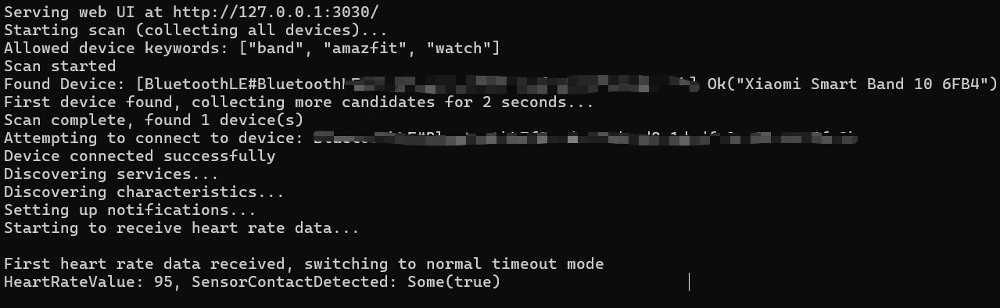
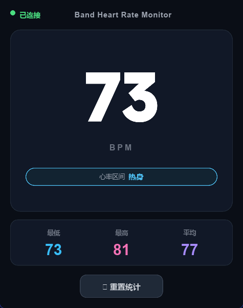

[English](README_EN.md) | [中文](README.md)

[](https://github.com/Roxy-0304/band-heart-rate/actions/workflows/ci.yml)
[](https://github.com/Roxy-0304/band-heart-rate/releases)
[](https://opensource.org/licenses/MIT)

## ⚠️ Disclaimer

> This project is forked from [Tnze/miband-heart-rate](https://github.com/Tnze/miband-heart-rate), code written by AI.

## About

**Band Heart Rate Monitor** is a native desktop heart rate monitoring application built with Rust and Slint. It receives real-time heart rate data from wearable devices via the standard BLE Heart Rate Service (UUID 0x180D). A built-in HTTP server supports REST and SSE real-time push, making it easy to integrate with live stream overlays.

You need to enable the heart rate broadcast function in your wearable device's settings.

> 💡 Latest builds can be downloaded from [GitHub Releases](https://github.com/Roxy-0304/band-heart-rate/releases).

## Features

- **Slint Native Window** — Minimal CPU and memory usage, high frame rate
- **Real-time Heart Rate Display** — Large digits with real-time refresh, auto-detect Warmup/Fat Burn/Aerobic/Limit zones
- **Live Statistics** — Min/Max/Average heart rate with one-click reset
- **HTTP API** — REST endpoints + SSE real-time push
- **Auto Reconnect** — Automatic scan and reconnect with exponential backoff
- **Cross-platform** — Windows / macOS / Linux

## Quick Start

### Download

Go to [GitHub Releases](https://github.com/Roxy-0304/band-heart-rate/releases) to download the executable for your platform and run it directly.

### Build from Source

```bash
git clone https://github.com/Roxy-0304/band-heart-rate.git
cd band-heart-rate

# With GUI
cargo build --release

# Headless (HTTP API only)
cargo build --release --no-default-features
```

**Requirements:** [Rust toolchain](https://www.rust-lang.org/tools/install) (rustup recommended)

## Usage

1. Enable **Heart Rate Broadcast** in your band/watch settings
2. Ensure Bluetooth is enabled on your device
3. Run the program — it automatically scans and connects to heart rate devices
4. Heart rate data is displayed in real-time in the native window and accessible via HTTP API

## HTTP API

| Endpoint | Description |
|----------|-------------|
| `GET /heart-rate` | Current heart rate as JSON |
| `GET /heart-rate-stream` | SSE real-time heart rate stream |
| `GET /health` | Health check |

Default address: `http://127.0.0.1:3030` (random port if occupied).

## Environment Variables

| Variable | Description | Default |
|----------|-------------|---------|
| `MIBAND_ALLOWED_DEVICES` | Comma-separated device name keywords for allowed connections | `band,amazfit,watch,mi` |

## Compatible Devices

Compatible with any wearable device that supports the standard BLE Heart Rate Service (UUID 0x180D). Tested on Windows 10/11, macOS, and Linux.

Supported devices include: Xiaomi Mi Band, Honor Band, Huawei Band/Watch, Amazfit, Apple Watch, and more. Enable "Heart Rate Broadcast" in your device settings to be detected.

## Screenshots

**Backend Native Interface**



**Frontend Web Interface**



## License

[MIT](LICENSE)